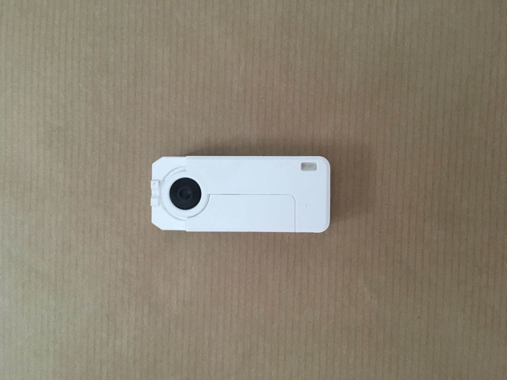

>### This Project Is Now Deprecated

>## Deprecated in favour of [smartcard](https://github.com/tomkp/smartcard) - give it a try instead....

-----------------


# Card Reader

A simple wrapper around [Santiago Gimeno's](https://www.npmjs.org/~sgimeno) great [pcsclite](https://github.com/santigimeno/node-pcsclite) library.


Emits events for:

* device-activated
* device-deactivated
* card-inserted
* card-removed
* issue-command
* receive-response
* error


## Examples

```javascript
var cardreader = require('../lib/card-reader');

cardreader.on('device-activated', function (reader) {
    console.log(`Device '${reader.name}' activated`);
});

cardreader.on('device-deactivated', function (reader) {
    console.log(`Device '${reader}' deactivated`);
});

cardreader.on('card-removed', function (reader) {
    console.log(`Card removed from '${reader.name}' `);
});

cardreader.on('command-issued', function (reader, command) {
    console.log(`Command '${command}' issued to '${reader.name}' `);
});

cardreader.on('response-received', function (reader, response, command) {
    console.log(`Response '${response}' received from '${reader.name}' in response to '${command}'`);
});

cardreader.on('error', function (message) {
    console.log(`Error '${message}' received`);
});

cardreader.on('card-inserted', function (reader, status) {

   console.log(`Card inserted into '${reader.name}' `);
   // issue a command...

   // ...either callback style
   cardreader.issueCommand('00A404000E315041592E5359532E4444463031', function (err, response) {
       if (err) {
           console.error(err);
       } else {
            console.log(`Response '${response.toString('hex')}`);
       }
   });
       
   // ...or as a promise
   cardreader
        .issueCommand('00A404000E315041592E5359532E4444463031')
        .then(function (response) {
            console.log(`Response '${response.toString('hex')}`);
        }).catch(function (error) {
            console.error(error);
        });
});


```

## Compatible Readers

Tested on Mac OSX with the SCM SCR3500 Smart Card Reader. 
This library *should* work with most PC/SC readers - I'll update this page when I get to test others.
If you know of any other devices that work please let me know.
 

<div align="center">
   
</div>

<div align="center">
   
</div>